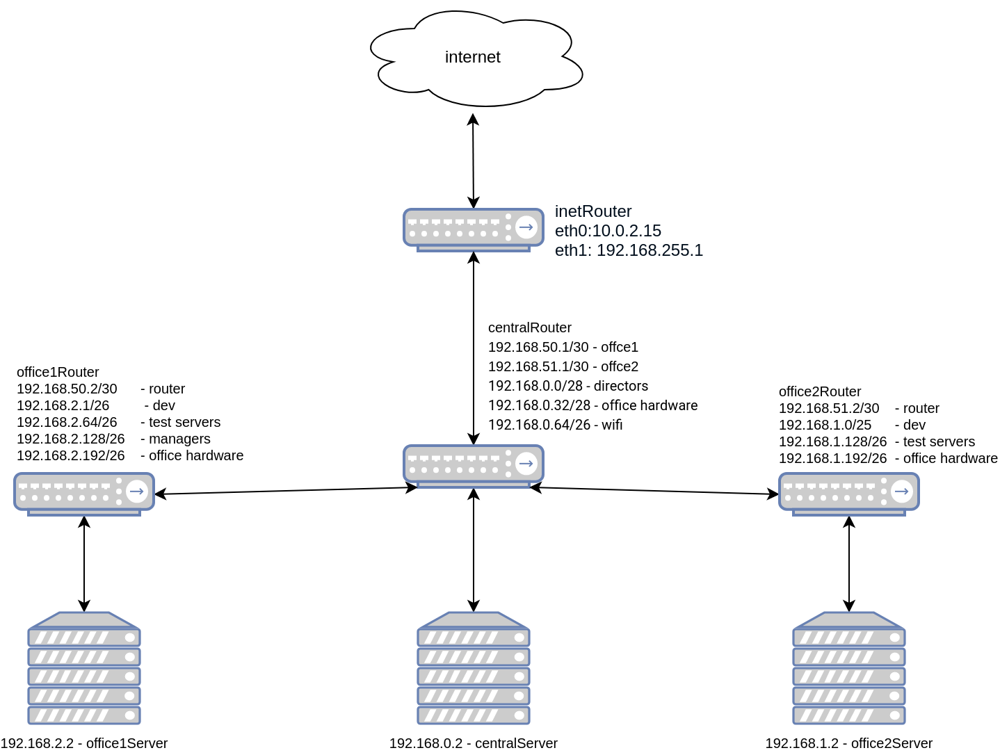

## Архитектура сетей

### Теоретическая часть
- Найти свободные подсети
- Посчитать сколько узлов в каждой подсети, включая свободные
- Указать broadcast адрес для каждой подсети
- проверить нет ли ошибок при разбиении

#### Сети будем смотреть с помощью утилиты ipcalc (ipcalc -b без вывода двоичной информации):
    Свободные подсети:
   
    192.168.0.128/25 
    Broadcast: 192.168.0.255

    192.168.0.16/28 
    Broadcast: 192.168.0.31

    192.168.0.48/28 
    Broadcast: 192.168.0.63

    Сеть office1
    - 192.168.2.0/26 - dev
      Address:   192.168.2.0          
      Netmask:   255.255.255.192 = 26 
      Network:   192.168.2.0/26       
      HostMin:   192.168.2.1          
      HostMax:   192.168.2.62         
      Broadcast: 192.168.2.63         
      Hosts/Net: 62                    

    - 192.168.2.64/26 - test servers
      Address:   192.168.2.64         
      Netmask:   255.255.255.192 = 26 
      Network:   192.168.2.64/26      
      HostMin:   192.168.2.65         
      HostMax:   192.168.2.126        
      Broadcast: 192.168.2.127        
      Hosts/Net: 62

    - 192.168.2.128/26 - managers
      Address:   192.168.2.128        
      Netmask:   255.255.255.192 = 26 
      Network:   192.168.2.128/26     
      HostMin:   192.168.2.129        
      HostMax:   192.168.2.190        
      Broadcast: 192.168.2.191        
      Hosts/Net: 62 

    - 192.168.2.192/26 - office hardware
      Address:   192.168.2.192        
      Netmask:   255.255.255.192 = 26 
      Network:   192.168.2.192/26     
      HostMin:   192.168.2.193        
      HostMax:   192.168.2.254        
      Broadcast: 192.168.2.255        
      Hosts/Net: 62  

    Сеть office2
    - 192.168.1.0/25 - dev
      Address:   192.168.1.0          
      Netmask:   255.255.255.128 = 25 
      Network:   192.168.1.0/25       
      HostMin:   192.168.1.1          
      HostMax:   192.168.1.126        
      Broadcast: 192.168.1.127        
      Hosts/Net: 126

    - 192.168.1.128/26 - test servers
      Address:   192.168.1.128        
      Netmask:   255.255.255.192 = 26 
      Network:   192.168.1.128/26     
      HostMin:   192.168.1.129        
      HostMax:   192.168.1.190        
      Broadcast: 192.168.1.191        
      Hosts/Net: 62

    - 192.168.1.192/26 - office hardware 
      Address:   192.168.1.192        
      Netmask:   255.255.255.192 = 26 
      Network:   192.168.1.192/26     
      HostMin:   192.168.1.193        
      HostMax:   192.168.1.254        
      Broadcast: 192.168.1.255        
      Hosts/Net: 62 

    Сеть central
    - 192.168.0.0/28 - directors
      Address:   192.168.0.0          
      Netmask:   255.255.255.240 = 28 
      Network:   192.168.0.0/28       
      HostMin:   192.168.0.1          
      HostMax:   192.168.0.14         
      Broadcast: 192.168.0.15         
      Hosts/Net: 14 

    - 192.168.0.32/28 - office hardware
      Address:   192.168.0.32         
      Netmask:   255.255.255.240 = 28 
      Network:   192.168.0.32/28      
      HostMin:   192.168.0.33         
      HostMax:   192.168.0.46         
      Broadcast: 192.168.0.47         
      Hosts/Net: 14 

    - 192.168.0.64/26 - wifi
      Address:   192.168.0.64         
      Netmask:   255.255.255.192 = 26 
      Network:   192.168.0.64/26      
      HostMin:   192.168.0.65         
      HostMax:   192.168.0.126        
      Broadcast: 192.168.0.127        
      Hosts/Net: 62  

### Практическая часть
- Соединить офисы в сеть согласно схеме и настроить роутинг
- Все сервера и роутеры должны ходить в инет черз inetRouter
- Все сервера должны видеть друг друга
- у всех новых серверов отключить дефолт на нат (eth0), который вагрант поднимает для связи
- при нехватке сетевых интервейсов добавить по несколько адресов на интерфейс
  

   

    Главным роутером в схеме является centralRouter, 
    для связки с другими сетями добавили на интерфейс eth1 дополниельные ip на схеме они отражены.
    
##### Решение представлен в vagrant можно склонировать и запустить.

